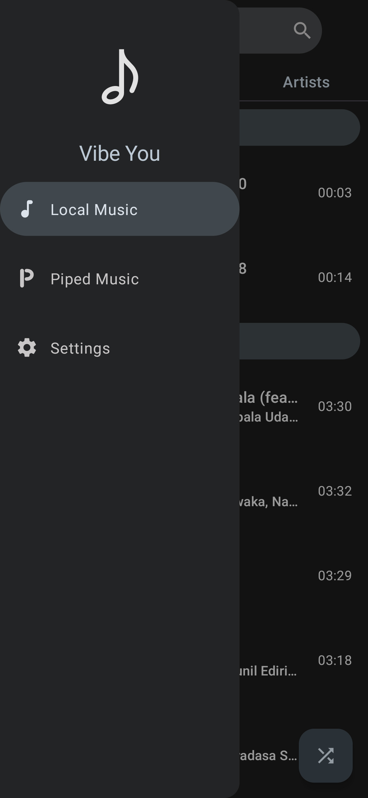
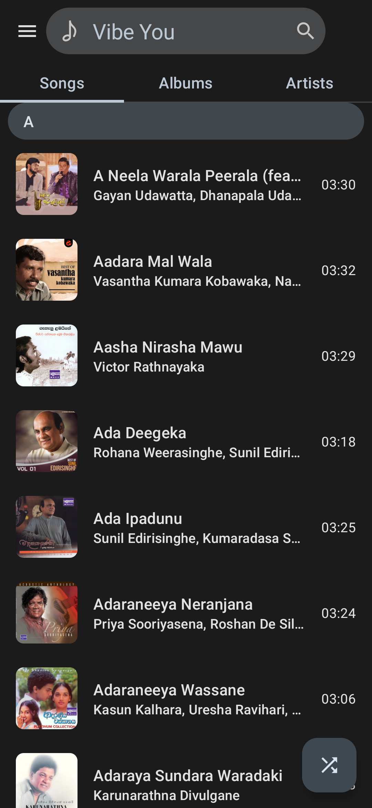
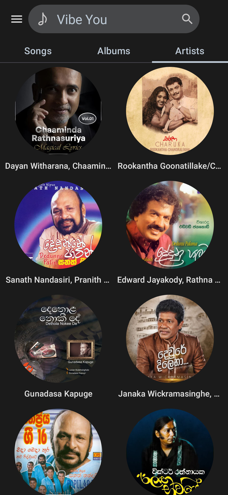
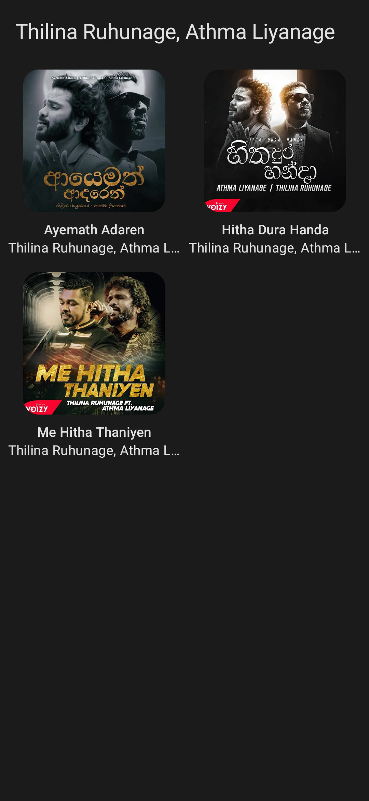
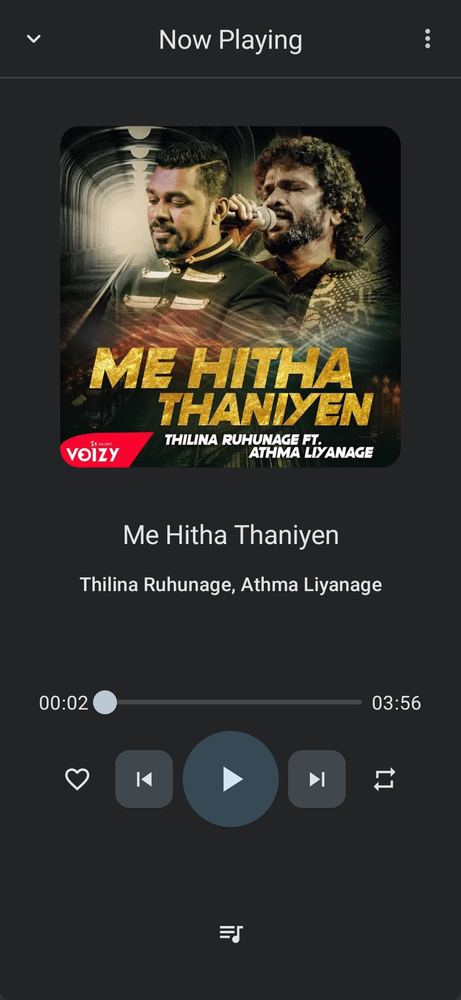
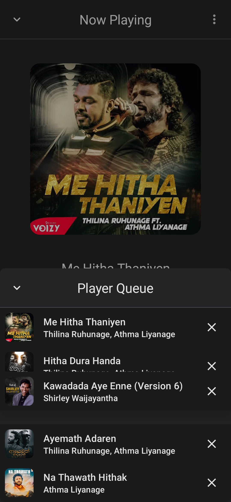

> [!WARNING]  
> This repository is no longer maintained! The app is considered feature-complete though and will continue to work in the future, even though no further updates will be released.

  
  <h1 align="center">Vibe You</h1>
  <b>Vibe You</b> (formerly MellowMusic) is a music app that lets you play music from your device storage and Piped Music.
   It has a Material You dynamic theme with dark mode support, offline cached playback, shuffle, queue, and more.

 

    
    
    
    
    
     

---

  
  Screenshots

  
  
  

  
  
  

  

## Features

- **Material You dynamic theme with dark mode support:** Enjoy a sleek and modern interface that
  matches your device's theme.
- **Play songs from your device storage:** Play your favorite songs, even when you're offline.
- **Listen to online songs from Piped Music:** Access Piped Music's vast library of songs,
  without region blocks.
- **Offline cached playback:** Listen to your music offline, even without an internet connection.
- **Add songs to a favorite playlist:** Create playlists of your favorite songs and listen to them
  on demand.
- **Shuffle songs:** Listen to your music in random order.
- **Advanced queue management:** Add/Remove and reorder queue to personalize listening experience.

## Installation

<!-- ---------- Contribution ---------- -->
## Feedback and contributions
***All contributions are very welcome!***

* Feel free to join the [Matrix room](https://matrix.to/#/#you-apps:matrix.org) for discussions about the app.
* Bug reports and feature requests can be submitted [here](https://github.com/you-apps/VibeYou/issues) (please make sure to fill out all the requested information properly!).
* If you are a developer and wish to contribute to the app, please **fork** the project and submit a [**pull request**](https://help.github.com/articles/about-pull-requests/).

## Translation

## Credits
* Icon design by [M00NJ](https://github.com/M00NJ)

## License

Vibe You is licensed under the [**GNU General Public License**](https://www.gnu.org/licenses/gpl.html): You can use, study and share it as you want.

