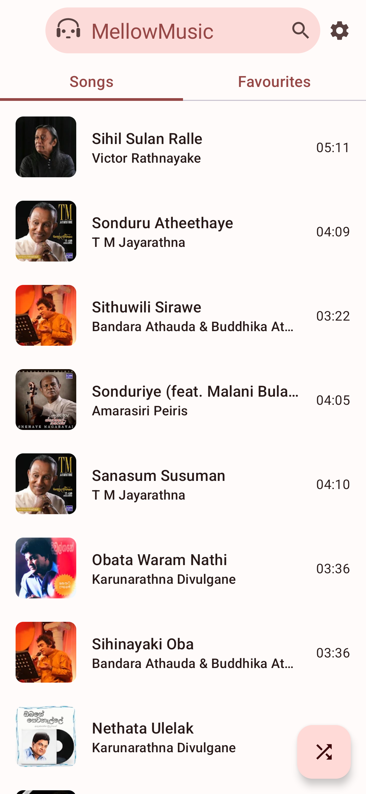
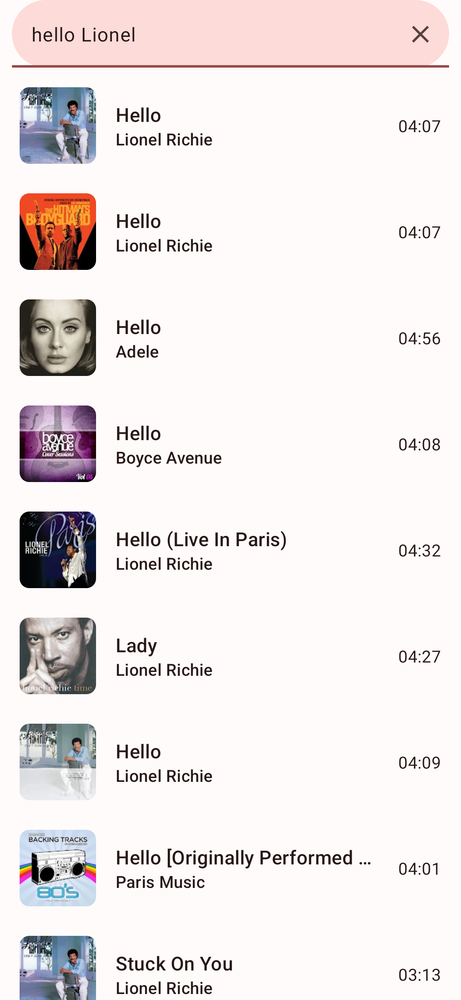
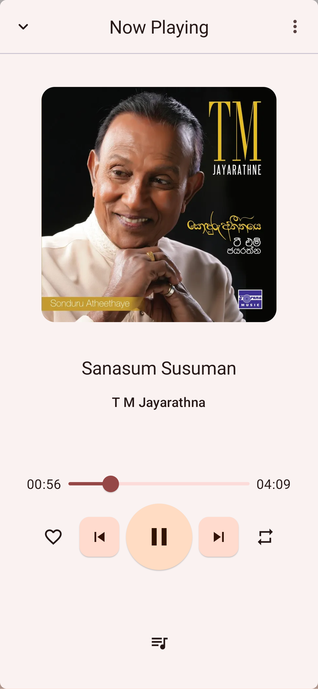
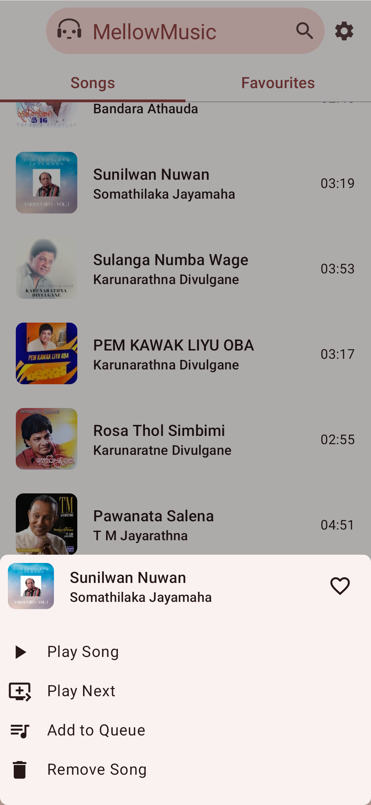
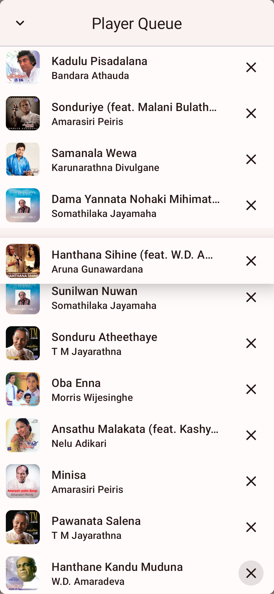

  
  <h1 align="center">Vibe You</h1>
  <b>Vibe You</b>(formerly MellowMusic) is a music app that lets you play music from your device storage and Piped Music. It has a Material You dynamic theme with dark mode support, offline cached playback, shuffle, queue, and more.

 

    
    
    
    
    
     

---

  
  Screenshots

  
  
  

  
  

## Features

- **Material You dynamic theme with dark mode support:** Enjoy a sleek and modern interface that
  matches your device's theme.
- **Play songs from your device storage:** Play your favorite songs, even when you're offline.
- **Listen to online songs from Piped Music:** Access Piped Music's vast library of songs,
  without region blocks.
- **Offline cached playback:** Listen to your music offline, even without an internet connection.
- **Add songs to a favorite playlist:** Create playlists of your favorite songs and listen to them
  on demand.
- **Shuffle songs:** Listen to your music in random order.
- **Advanced queue management:** Add/Remove and reorder queue to personallize listening experience.

## Installation

## 🧾 Translation

[Crowdin Translate](https://crowdin.com/project/mellowmusic/)

